# Phase 1 (Crawl): Instrumented Manual Roaster

## Goals

By the end of this phase, we'll have a working DIY heat-gun coffee roaster that:

- Mechanically follows Larry Cotton's flour-sifter roaster design, with a handful of safety and quality-of-life improvements.
- Logs **bean-mass temperature (BT)**, **environmental temperature (ET)**, and **paddle motor speed** to Home Assistant in real time.
- Surfaces a live **rate-of-rise (RoR)** curve while you roast.
- Has a software-controlled kill switch on the heat gun via a smart plug.
- Has a physical interlock (your hinge-lever microswitch) that disables the paddle motor when the sifter handle is lifted.

## Non-goals

- No automation. You're still operating the heat gun manually (high/low setting, on/off).
- No closed-loop control; that's Phase 2 (Walk).
- No camera, no audio first-crack detection, no AI; that's Phase 3 (Run).

## What We Change Vs. the Make: Article

Cotton's build is sound, but it was published in 2019 with no electronics layer beyond a 12V motor adapter. The meaningful upgrades for our version:

1. **Aluminum heat shield on the plywood base near the heat gun.** A 1500W gun aimed straight up at wood is the kind of thing that bites you on roast #47. Cheap insurance.
2. **Cooling station from day one**. A perforated half-sheet pan over a box fan, instead of dumping into a baking pan. Drops the beans below 200°F in under a minute. Way simpler than the article's fan-bracket version, and you keep the small base.
3. **Electronics enclosure** mounted to the side of the base keeps the ESP32, thermocouple amps, and motor driver out of the heat path and accessible for servicing.
4. **Through-panel thermocouple connectors** so you can disconnect the sifter from the base without unsoldering anything.
5. **GFCI protection** on the heat-gun circuit. The article mentions a 15A circuit; we go further.
6. **Optional 3D-printed parts** to replace the hardest hand-fabbed pieces (pivot bracket, HG locator). Skip if you don't have a printer; the original aluminum/plywood versions work fine.
7. **Slightly larger paddle-to-screen clearance** (1/8" instead of 1/16"). Cotton notes that one paddle dragging is OK; we'd rather have neither dragging because we want this thing to last more than a season.

## Shopping List

You already have: flour sifter, heat gun, 6mm flange couplings, Greartisan 12V 60RPM gearmotor, hinge-lever microswitch.

### Mechanical / Structural (~$70)

| Item                                                              | Notes                                            | ~Price    |
| ----------------------------------------------------------------- | ------------------------------------------------ | --------- |
| ½" project plywood, ~2'×2'                                        | For base, supports, stops                        | $15       |
| 2×4 scrap, 6" length                                              | Motor mount block                                | free / $3 |
| Aluminum bar, 1/16" × 1½" × 24"                                   | For brackets, paddles, crank rotator             | $12       |
| Aluminum sheet, .020–.025" thick, 12" × 18"                       | Heat shield + nozzle bracket + wind-break funnel | $10       |
| ¼" wood dowel, 12"                                                | Heat gun handle stop                             | $2        |
| 10D common nail (3")                                              | Sifter pivot pin                                 | $1        |
| Assorted #6 sheet metal & wood screws, 6-32 machine screws + nuts | Whole build                                      | $12       |
| Spray paint or clear Deft                                         | Finish                                           | $8        |
| Half-sheet perforated baking pan (13"×18")                        | Cooling tray                                     | $15       |
| Box fan, 20"                                                      | Cooling                                          | own / $20 |
| Wire cooling rack to fit pan                                      | Air gap under cooling pan                        | $8        |

### Electronics (~$60)

| Item                                                                         | Notes                                                                                                                      | ~Price |
| ---------------------------------------------------------------------------- | -------------------------------------------------------------------------------------------------------------------------- | ------ |
| ESP32 dev board (NodeMCU-32S or DevKitC)                                     | Brain                                                                                                                      | $8     |
| 2× K-type thermocouples, beaded tip, ungrounded, glass-braid sleeve          | One BT, one ET. **Ungrounded matters**. Grounded probes confuse cold-junction comp                                         | $12    |
| 2× Adafruit MAX31856 breakouts (or clones)                                   | Thermocouple amps with proper K-type cold-junction compensation. Don't use MAX6675; it's a step down in accuracy and noise | $24    |
| DRV8871 motor driver breakout                                                | PWM speed control for the Greartisan                                                                                       | $7     |
| HA-compatible smart plug (Kasa KP125 or any Tasmota/ESPHome-flashable Athom) | AC kill for heat gun                                                                                                       | $15    |
| 12V → 5V buck converter, 1A                                                  | Power ESP32 from same 12V supply as motor                                                                                  | $5     |
| 12VDC 2A power supply                                                        | Powers motor + ESP32 via buck                                                                                              | $10    |
| ABS project enclosure, ~4×3×2"                                               | Mounts to side of base                                                                                                     | $8     |
| 2× panel-mount K-type thermocouple jacks + plugs                             | Through-panel disconnect for sensors                                                                                       | $12    |
| Hookup wire, JST-XH connectors, screw terminals, Dupont jumpers              | Wiring kit                                                                                                                 | $10    |

### Safety (~$25)

| Item                                    | Notes                                                   | ~Price |
| --------------------------------------- | ------------------------------------------------------- | ------ |
| GFCI extension cord, 14 AWG, 15A, 25 ft | Mandatory. The roaster is going outside or in a garage. | $25    |

**Phase 1 total: ~$155** (you'll spend less if you have a box fan and some hardware on hand).

## Build Sequence

I'm collapsing Cotton's 9 steps where possible and inserting the upgrades inline. Reference figures from the original article are embedded so you don't have to context-switch.

### Step 1: Cut the Base + Supports + Stops

Follow Cotton's Figure A and Figure B for dimensions. Use the **small-base** version (about 11"×16") since we're skipping the integrated fan-cooled tray. Drill and countersink the six mounting holes (A–F) for supports and stops. Make the supports and stops to Figure B. Paint or seal everything before assembly; it's easier than masking later.

Mount the two pivot supports and the handle stop to the base from underneath with #6×1" flat-head wood screws. Mount the dump stop between the pivot supports at ~45° with two #6×1" pan-head screws.

> **Upgrade:** Before mounting the supports, cut a piece of .020" aluminum sheet roughly 8"×6" and screw it to the top of the base in the area directly under where the heat gun nozzle will sit. Standoff it ~1/8" off the plywood with washers if you want an air gap. This is your heat shield. Trim around the supports as needed.

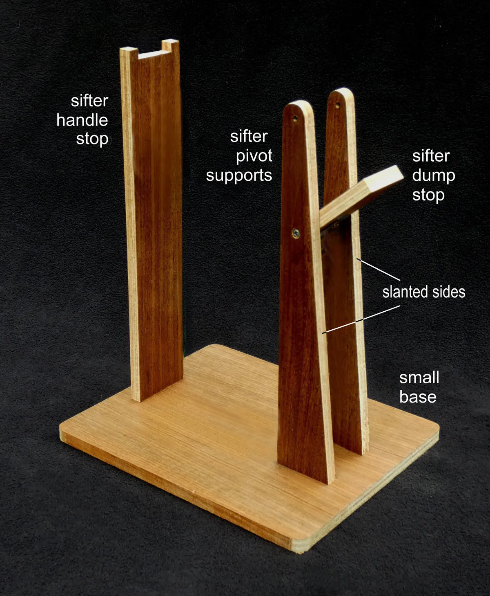

### Step 2: Modify the Flour Sifter

This is unchanged from Cotton's article:

1. Remove the brass nut on the hand-crank axle. Save it.
2. Discard the nylon washer.
3. Hold the agitator while turning the axle counterclockwise to unscrew the axle. Pull out and discard the agitator.
4. Hacksaw or break off the black plastic crank knob.
5. With the crank in a vise, hacksaw it down to about ½" of stub and file smooth. (See Figure J below for finished length.)
6. Reinsert the axle and replace the brass nut.

### Step 3: Make the Wood and Aluminum Parts

Per Cotton's Figure D, fabricate:

- Motor mount (2×4 scrap, painted)
- Motor mounting plate (1/16" aluminum, drilled to 15mm × 27mm pattern for the M3 motor screws. Verify against your Greartisan's actual hole pattern, drill slightly oversize if needed)
- Crank rotator (1/16" aluminum strip)
- Sifter pivot bracket (1/16" aluminum strip, ~6" long, formed per Figure E)

The pivot bracket is the trickiest hand-fab piece. Cotton's drilling jig (Figure E) is genuinely clever: drill a 5/32" hole in your scrap stock first, then use that to align both pivot holes against a 10D nail. Bend, then trim to length.

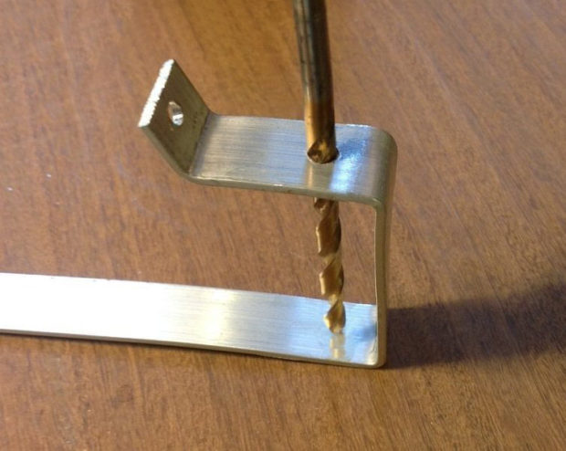

### Step 4: Motorize the Sifter

Largely Cotton's procedure, with one wiring deviation:

1. Bolt the Greartisan motor to the mounting plate with M3×6mm screws.
2. Attach the plate to the wood motor mount with two #6 screws.
3. Slip one of your 6mm flange couplings onto the motor shaft. Tighten the setscrew on the shaft's flat.
4. Bolt the crank rotator to the coupling flange with two 6-32×¼" screws.
5. Drill the sifter top per Cotton's Figures G and H. Two 3/32" holes for pivot bracket screws, two 5/32" holes for motor mount screws. A drill press helps; that sifter steel is tough.
6. Mount the motor assembly through the sifter top (Figure J). Verify the rotator engages the trimmed crank stub and clears the wood mount when rotating.
7. Mount the pivot bracket on the opposite side.
8. Drop the assembled sifter onto the base pivot supports with the 10D nail as the pivot axle. Verify that the handle seats are properly in the handle-stop recess and that the sifter pivots cleanly to the dump position.

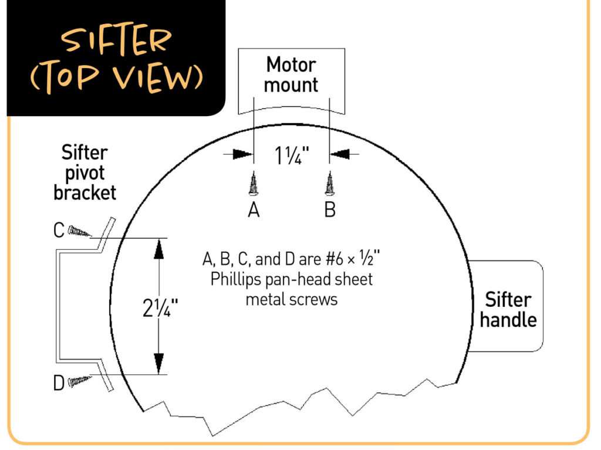

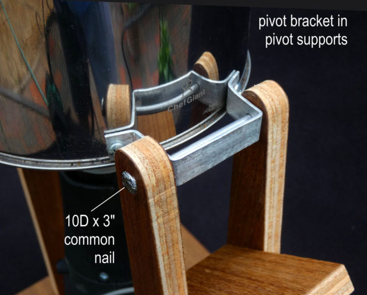

> **Wiring deviation:** Don't connect the motor straight to the 12V adapter the way the article does. Run the motor leads to the **DRV8871 motor driver** instead. The driver lives in the project enclosure (next step). The Greartisan is rated well within the DRV8871's 3.6A continuous limit.

### Step 5: Heat Gun Mounting Parts

Follow Cotton's procedure exactly for:

- **Wind-break funnel** (Figures L and M). Wrap aluminum into a cone, rivet, and slip over the heat gun nozzle.
- **HG nozzle bracket** (Figures N and O). 1½" hole in aluminum sheet, screwed to the handle stop.
- **HG locator** (Figure P). ¼" plywood with three glued-on alignment blocks, sized to your specific Harbor Freight gun's air intake cap.
- **HG handle dowel** (Figure T). ¼" dowel that traps the gun's handle against a pivot support.

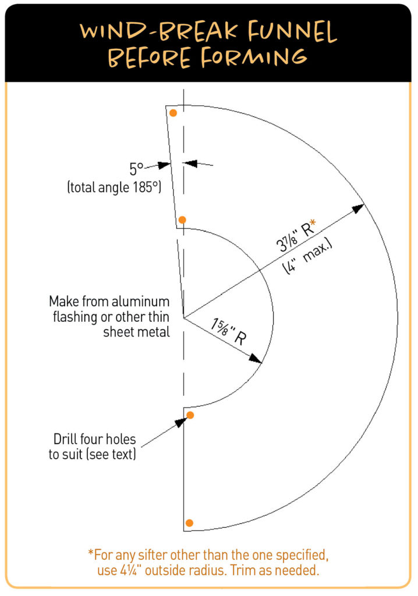

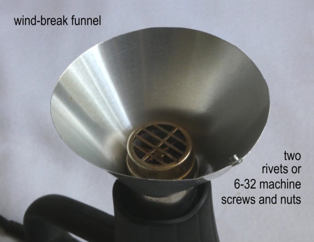

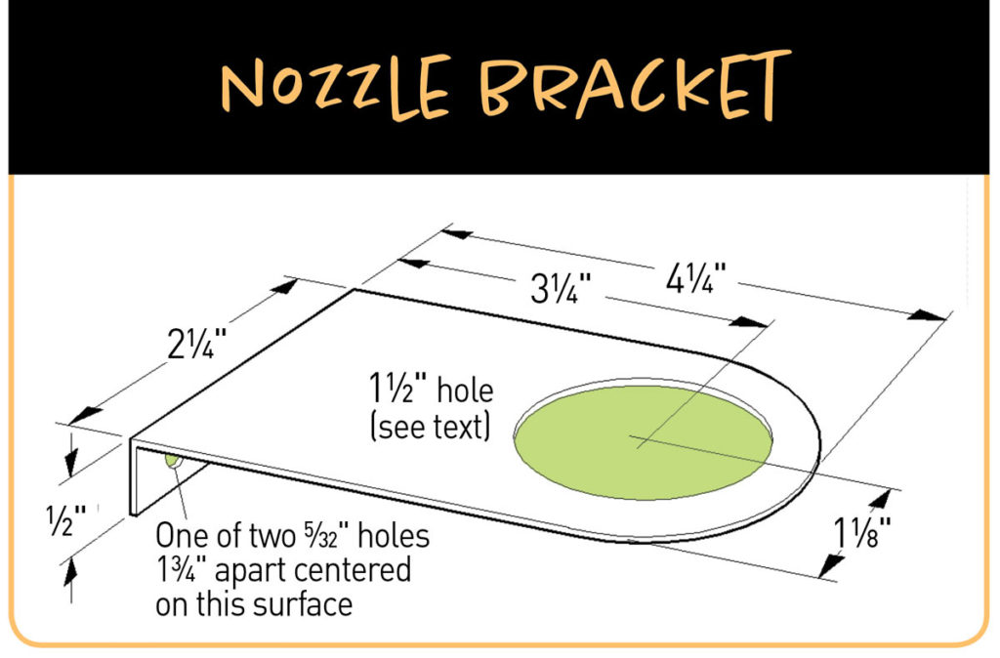

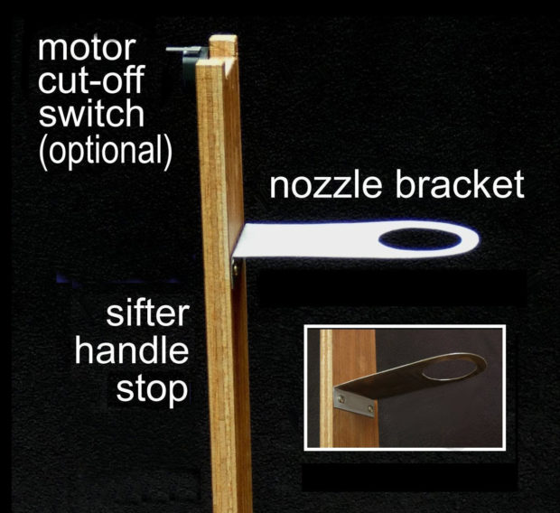

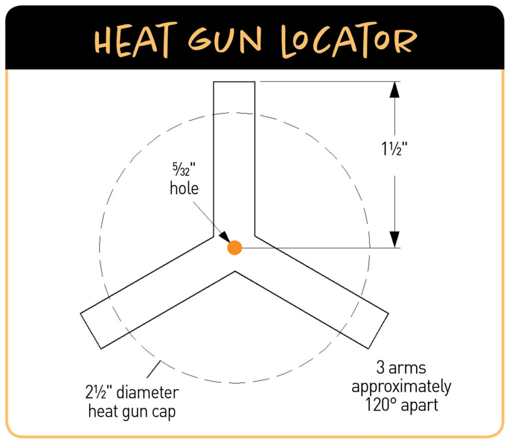

Position everything per Cotton's Figures Q–T: heat gun under the sifter, nozzle through the bracket, looking straight up through the funnel, locator screwed to the base in pencil-marked position, handle dowel inserted to trap the gun.

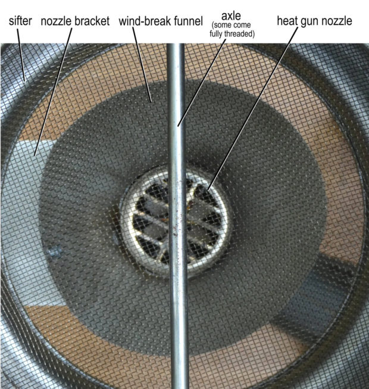

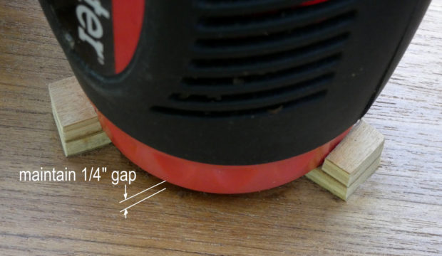

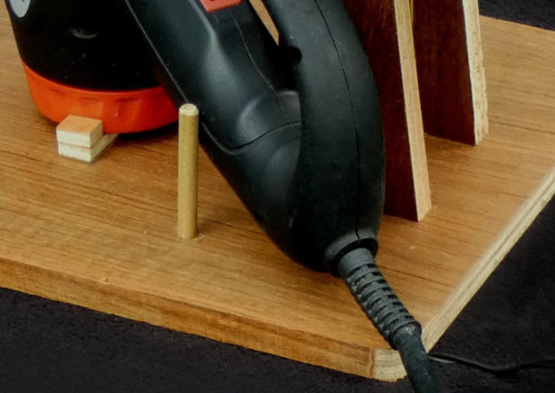

### Step 6: Make the Paddles

Follow Cotton's Figure U for paddle dimensions. Round the curved ends to match the sifter screen radius (~3").

The drilling and twisting procedure is unchanged (Figures U and V):

1. Clamp both paddles overlapped, drill four 7/64" holes through both at once at the dimensions shown.
2. Tap one paddle's holes for 6-32 machine screws.
3. Drill the other paddle's holes out to 5/32".
4. Twist each paddle in opposite directions, ~25–30°, using a slotted scrap-wood "twister."

> **Upgrade:** Aim for a **1/8" paddle-to-screen clearance** rather than the 1/16" Cotton suggests. You lose a small amount of bean agitation but you protect the screen. Bean stalls between paddle and rim are catastrophic for a roast… better margin is worth it.

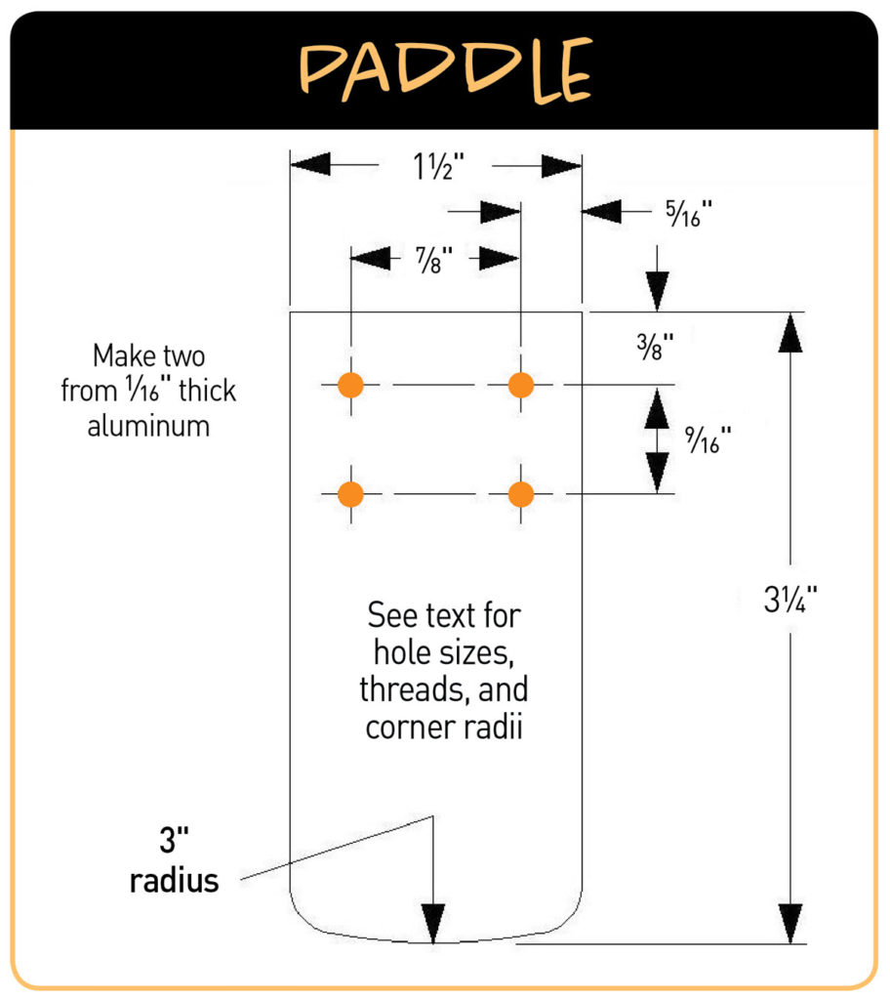

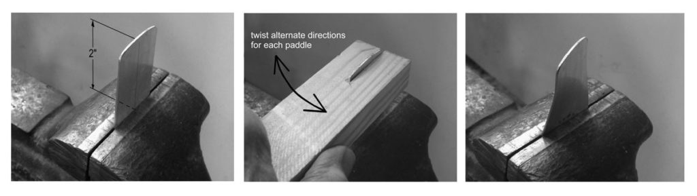

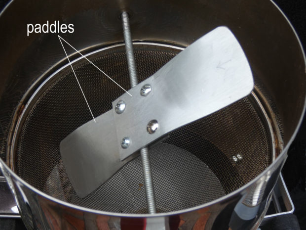

### Step 7: Install Thermocouples (NEW)

This is the upgrade that makes the whole project worth doing.

**Bean-mass temperature (BT) probe:**

1. Drill a 1/8" hole through the side of the sifter body, low enough that the probe tip will sit _inside_ the bean mass during a roast (about 1" up from the bottom of the screen).
2. Feed the K-type probe through the hole, beaded tip pointing inward, with the tip extending about 1.5" into the chamber.
3. Secure the probe sheath to the sifter body with a small high-temp silicone bead or a metal P-clamp.
4. Route the lead wire away from the heat gun's airflow, up over the top of the sifter, and down to a panel-mount K-type jack on the side of the project enclosure.

**Environmental temperature (ET) probe:**

1. Drill a 1/8" hole in the wind-break funnel, about halfway up its length.
2. Feed the second K-type probe in so the tip sits in the airstream above the heat gun nozzle but below the sifter screen.
3. Same routing: secure with silicone, run wire to the second panel-mount jack.

The panel-mount jacks let you completely disconnect the sifter from the base for service, just by unplugging two K-type connectors and one DC power lead.

### Step 8: Build the Cooling Station (NEW, Replaces Fan-bracket version)

Cotton's fan-bracket-and-tray version is mechanically clever but it bloats the base. We're doing something simpler.

1. Set the box fan flat on a stable surface (workbench, garage floor, whatever).
2. Place the wire cooling rack on top of the fan, suspended by something heat-safe at the four corners: a brick at each corner, or four small pieces of wood.
3. Set the perforated half-sheet pan on the rack.

That's the whole cooling station. After roasting, you tip the sifter to dump beans into the pan; the box fan pulls room-temp air _through_ the perforations and through the bean layer at high CFM. Beans drop from ~400°F to handleable in 60–90 seconds. Stir them once with a wooden spoon during the cooldown.

It's cheaper than Cotton's version, easier to clean, and works with bigger batches if you ever want to scale up.

### Step 9: Wire the Electronics Enclosure (NEW)

The only stage where you'll spend real time on something the Make: article doesn't cover. Keeping it high-level since you said you'd handle code and config later.

**Inside the project box, mounted to the side of the base:**

- **ESP32 dev board** screwed to standoffs.
- **DRV8871 motor driver** mounted nearby. Two PWM input pins from ESP32; two output pins to motor; 12V power input from the supply.
- **2× MAX31856 breakouts** mounted on a small piece of perfboard. Each shares the SPI bus (MOSI, MISO, CLK) with the ESP32 but has its own chip-select pin. Each one's thermocouple inputs come from the panel-mount K-type jacks.
- **12V → 5V buck converter** taking 12V in from the supply and outputting 5V to the ESP32's VIN pin (or USB if you'd rather power it that way during dev).
- **Hinge-lever microswitch (your existing part)** wired between the ESP32 and a digital input pin, with a pull-up. Mount the switch to the top of the sifter handle stop the way Cotton does in his Figure O / X. When the handle is lifted, the switch opens, and the ESP32 cuts the motor PWM signal in software.

**External connections (panel-mount on the enclosure):**

- DC barrel jack for 12V supply input
- 2× K-type thermocouple jacks
- 2-pin connector for motor leads
- 2-pin connector for microswitch leads (or hardwire, your call)

**Smart plug:**

Goes between the wall outlet and the heat gun. The smart plug is HA-controlled; its only Phase 1 job is to be a soft kill: if BT spikes above 480°F, ET above 600°F, or if the microswitch trips during heating, an HA automation cuts power to the plug. The heat gun also has its own physical switch you'll use as the primary on/off during normal roasts.

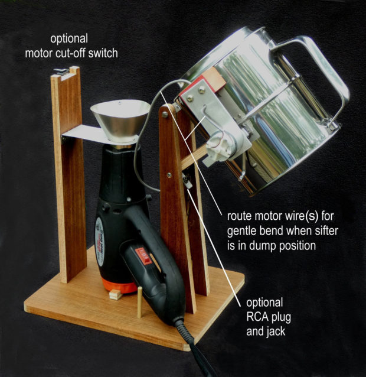

## Software Stack Overview

You'll cross this bridge later. Sketching the shape so you know what's coming:

- **ESPHome firmware** flashed to the ESP32. Native HA integration via the ESPHome dashboard add-on; no Arduino IDE, no MQTT broker.
- **Sensors exposed to HA:** `sensor.roastronaut_bean_temp`, `sensor.roastronaut_env_temp`, `sensor.roastronaut_motor_speed`, `binary_sensor.roastronaut_handle_in_position`, `switch.roastronaut_motor_enable`, `switch.roastronaut_heat_gun` (the last one is the smart plug, exposed via its own integration).
- **Derived sensor:** RoR (rate of rise, °F/min) computed in HA as a template sensor: first derivative of BT smoothed over 30 seconds.
- **Lovelace dashboard:** live BT/ET line chart, RoR gauge, motor speed slider, handle interlock indicator, heat gun kill button. ApexCharts card handles the time-series view well.
- **InfluxDB or HA's built-in long-term statistics** for keeping every roast curve.

## First-roast Checklist

Before you load any beans:

- [ ] Roaster is outside or in a well-ventilated garage with the door open. Smoke is real.
- [ ] GFCI extension cord between the wall and the heat gun.
- [ ] Smart plug between the extension cord and the heat gun.
- [ ] The HA dashboard is up on a phone or laptop within sight.
- [ ] Cooling station set up downwind of the roaster.
- [ ] Both thermocouples reading reasonable room temp (~70–90°F) before you start.
- [ ] Lift the sifter handle, confirm the motor stops. Set it back down, confirm motor resumes.
- [ ] Toggle the smart plug from HA. Confirm the heat gun's indicator light goes on/off accordingly.
- [ ] Manually rotate the paddles by hand (motor unpowered) to verify no screen drag.

Then load 1 cup of green beans, motor on, heat gun on low, and watch the BT curve climb. Pull when you hear/see the roast you want, same as the original article.

## Phase Exit Criteria… When You're Ready for Walk

You can move on to Phase 2 once you've done all of the following:

- Successfully roasted at least **3 batches** of 12oz green beans to drinkable result.
- Logged BT and ET curves for those roasts that look qualitatively like real roast curves (steady climb, characteristic flattening at first crack, no wild noise).
- Verified the smart-plug kill works (test with a fake overtemp condition in HA).
- Verified the handle interlock kills the motor.
- Cooling station drops beans below 200°F in under 2 minutes.

If any of those don't pass, fix in Phase 1 before adding more complexity. The whole point of Crawl is a stable baseline.

## Decision Log

| Decision         | Choice                   | Rationale                                                                              |
| ---------------- | ------------------------ | -------------------------------------------------------------------------------------- |
| Thermocouple amp | MAX31856 ×2              | K-type CJC done right; MAX6675 too noisy at the precision we want for RoR              |
| Motor driver     | DRV8871                  | Single-direction PWM, cheap, well within ratings for the Greartisan                    |
| Microcontroller  | ESP32                    | First-class ESPHome support → zero glue code into HA                                   |
| Cooling          | Box fan + perforated pan | Simpler than the article's fan-bracket version, decouples cooling from roaster, scales |
| Heat gun control | Smart plug               | Phase 1 is telemetry-only on the heat side; on/off is enough. AC dimmer is Phase 2.    |
| Base size        | Small                    | We don't need the bigger fan-tray base                                                 |

## Credits & References

- Larry Cotton, "Simple Sifter Coffee Roaster," _Make: Magazine_, Nov 2019. [Source](https://makezine.com/projects/simple-sifter-coffee-roaster/) — all figures embedded above are his.
- Adafruit MAX31856 documentation — https://www.adafruit.com/product/3263
- ESPHome thermocouple component docs — https://esphome.io/components/sensor/max31856.html
